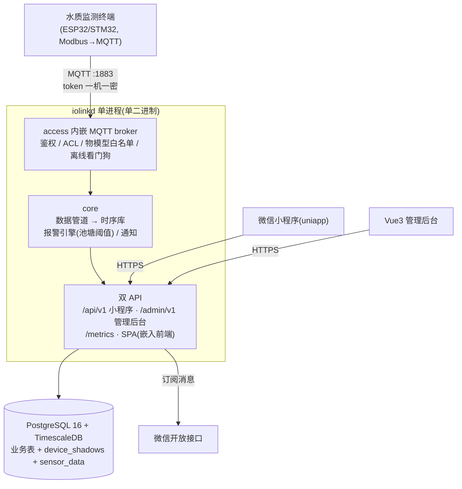

# IoLink — 智慧水产监测平台(自研服务)

三段式架构的**本服务器**:传感器(含水质监测终端)→ **iolinkd** → 微信小程序/管理后台。
自研单程序替代第一阶段「华为云 IoTDA + FunctionGraph」的托管方案;所有功能原生实现,无外部平台依赖。

## 架构(单程序)



- **access** 设备 MQTT 接入、三元组鉴权(sha256)、topic ACL、取值范围白名单、在线/离线看门狗
- **core** 数据校验入库(时序宽表)、设备影子、报警引擎(按池塘阈值+去重)、微信订阅消息通知
- **appapi** `/api/v1` 小程序接口(微信登录 JWT、池塘状态墙、实时/历史/报警)
- **adminapi** `/admin/v1` 管理接口(管理员登录、养殖场/池塘/设备/规则/报警管理)
- **web/admin** Vue3 管理后台,构建产物 `go:embed` 进二进制,单文件交付

数据量级:<100 设备 × 1min ≈ 14 万行/天,单实例绰绰有余;设计重心在边界清晰与可升级。

## 仓库结构(单仓)

全部代码在本仓,模块边界 = Go package,分工按交付物四条线(见 [docs/PLAN.md](docs/PLAN.md) §2):

```
iolink/
├── cmd/iolinkd/          # 单二进制入口(broker+core+双API+SPA+metrics)
├── cmd/mqtt-sim/         # 联调: 设备模拟器(周期上报)
├── cmd/mqtt-once/        # 联调: 单发消息(触发报警用)
├── internal/access/      # 设备接入(内嵌 mochi-mqtt broker)
├── internal/core/        # 数据管道/报警引擎/存储/通知
├── internal/appapi/      # 小程序 API /api/v1
├── internal/adminapi/    # 管理后台 API /admin/v1
├── internal/domain/      # 共享领域模型(唯一契约点,改动需评审)
├── internal/{event,wire}/  # 接入事件 / 设备载荷结构
├── internal/platform/    # config/log/db/口令哈希
└── web/admin/            # Vue3 管理前端源码(dist 用 go:embed 嵌入)
```

> 历史:原 iolink-access / iolink-appapi 独立仓已于 2026-09-16 并回本仓,GitLab 上已删除
> (完整历史备份在 ~/iolink-repo-backups/*.bundle)。

## 快速开始

```bash
git clone https://git.hyhy.fun/rsplab/iolink.git && cd iolink
make dev     # 起 PostgreSQL/TimescaleDB + iolinkd(:8080 API/后台, :1883 MQTT)
make test    # 全部 Go 测试
```

- 管理后台: http://localhost:8080/(种子账号 `admin / admin123`,**首次登录立即改密**)
- 健康检查: `curl localhost:8080/healthz`;指标: `curl localhost:8080/metrics`
- 模拟打数: `go run ./cmd/mqtt-sim -device dev-001 -secret <secret> -interval 5s`

## 文档(入口: [docs/README.md](docs/README.md))

| 文档 | 用途 |
|---|---|
| [docs/PLAN.md](docs/PLAN.md) + [PLAN-DETAILS.md](docs/PLAN-DETAILS.md) | 计划/里程碑/分工 + 需求追溯与各层设计 |
| [docs/api/admin-openapi.yaml](docs/api/admin-openapi.yaml) | 管理后台 API 契约(前端依赖) |
| [docs/api/openapi.yaml](docs/api/openapi.yaml) | 小程序 API 契约 |
| [docs/mqtt-spec.md](docs/mqtt-spec.md) | 设备接入规范(硬件依赖) |
| [docs/schema.sql](docs/schema.sql) | 数据库 DDL |
| [docs/FRONTEND-HANDOVER.md](docs/FRONTEND-HANDOVER.md) | 管理前端交接文档 |
| [docs/DEPLOY.md](docs/DEPLOY.md) | 生产部署(TLS/备份/监控/升级) |
| [docs/CONTRIBUTING.md](docs/CONTRIBUTING.md) | 协作规范 |

## 升级路线

第一阶段单机 docker-compose;设备永远只连 MQTT,小程序/后台永远只打本服务 API。
未来扩容或商业化:先纵向扩容,再按 package 边界拆独立进程——设备端与两个前端零改动。
