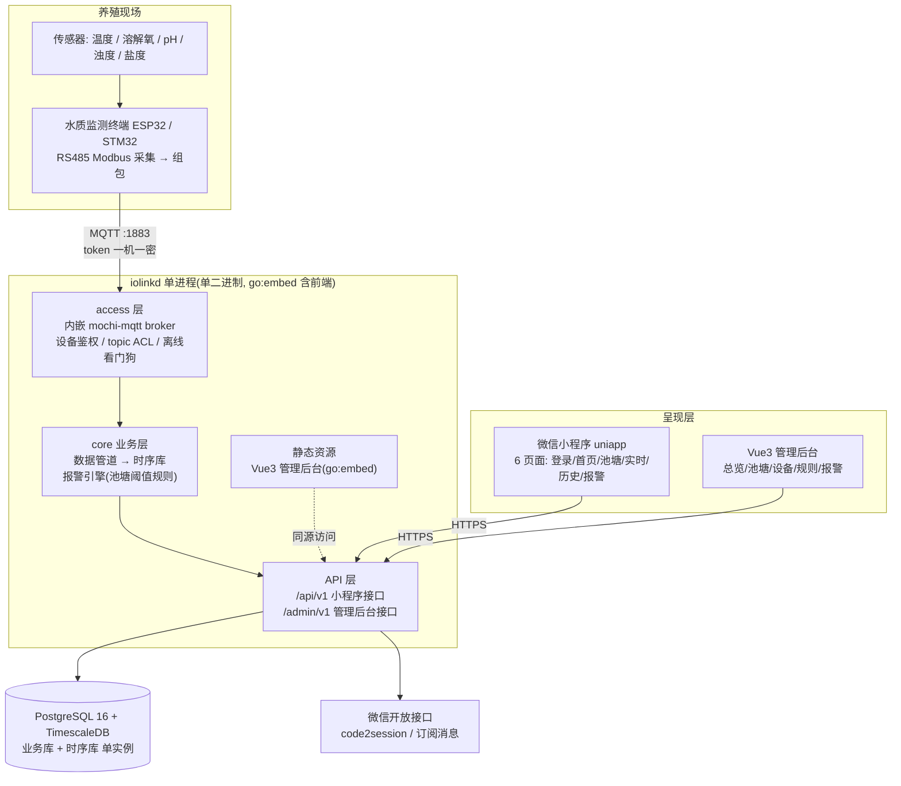
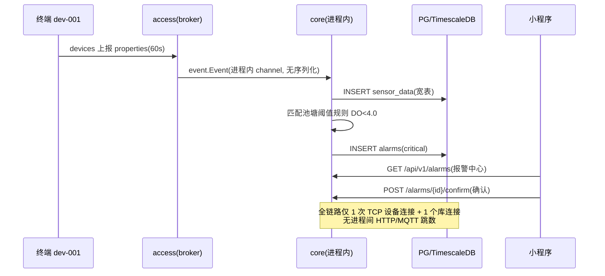
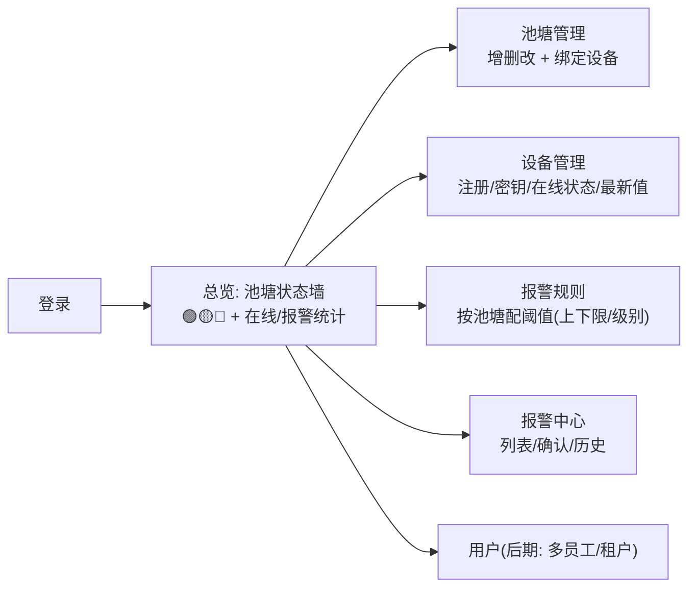

# 最终方案(完整版):单程序智慧水产监测平台

> 状态:**待评审** · v2(2026-09-16)
> v1(基座嵌入提案)的架构图排版损坏,本文重写并补全:前端方案、主程序方案、技术栈与结构、数据库方案(业务+时序)。
> 结论先行:**推荐路线 C——重起/延续自研单程序,前端全部 Vue 自建,ThingsPanel 降级为功能设计参照(不嵌入、不 fork)。** 三条路线的完整对比见第六节。

## 一、目标架构

### 1.1 系统总览



### 1.2 数据流(告警闭环)



## 二、主程序方案

### 2.1 仓库与模块结构

```text
iolink/(主仓, git.hyhy.fun/rsplab/iolink)
├── cmd/
│   ├── iolinkd/main.go        # 单二进制入口: 装配 broker+core+两个API+静态资源
│   ├── mqtt-sim/              # 联调模拟器(周期上报)
│   └── tp-spike-pub/          # spike 单发工具(保留作参照)
├── internal/
│   ├── access/                # 内嵌 broker: 鉴权/ACL/上行标准化/看门狗   [M1 已完成]
│   ├── core/                  # 管道/报警引擎/Repository 实现          [M1 已完成]
│   ├── appapi/                # 小程序 API(挂 /api/v1)               [M1 已完成]
│   ├── adminapi/              # 管理后台 API(挂 /admin/v1)【新增】
│   ├── domain/                # 领域模型与接口(从 contracts 并回,单程序无需跨仓)
│   └── platform/              # config/log/db
├── web/admin/                 # Vue3 管理后台源码, dist 用 go:embed 打进二进制【新增】
├── docs/                      # 契约与本文
├── deploy/docker-compose.yml  # iolinkd + PG/TimescaleDB(共 2 个容器)
└── contracts/                 # 【退役】单程序后并入 internal/domain
iolink-access/(模块仓)         # 【退役】逻辑并回主仓 internal/access
```

> 结构变化说明:既然确定单程序,原「主仓+两模块仓」的跨仓边界不再有收益,
> 合并回单仓(模块边界用 Go package 保持),负责人的分工改为按 package 分配——
> 这是响应"单程序"要求后的自然简化;两模块仓保留存档(tag v0.2.0)。

### 2.2 技术栈总表

| 层 | 技术 | 选择理由 |
|---|---|---|
| 主程序 | Go 1.26,单二进制 | 与团队栈一致;go:embed 打包前端 |
| MQTT broker | mochi-mqtt(内嵌) | 纯 Go 可嵌入,M1 已验证;留接口可外挂 EMQX |
| HTTP 框架 | Gin(appapi 已用)/ adminapi 同栈 | 统一 |
| 数据校验 | 物模型取值范围白名单 | mqtt-spec 已定义 |
| 权限 | JWT;admin 用 RBAC(casbin,后期) | 原型期 admin 单管理员 |
| 业务库 | PostgreSQL 16 | 事务/关系查询 |
| 时序库 | TimescaleDB(PG 扩展,同实例) | 一份运维;hypertable+retention |
| 管理后台 | Vue3 + TS + Vite + Element Plus,模板 soybean-admin/vben | Vue 生态成熟,模板自带布局/权限/请求封装 |
| 小程序 | uniapp(Vue3 语法) | 一套码将来可出 App |
| 部署 | docker-compose:iolinkd + timescaledb | 2 容器;生产换 systemd+pg 亦可 |

## 三、前端方案

### 3.1 管理后台(Vue3,面向运营者)



- 技术选型:soybean-admin(或 vben)模板起步——登录/布局/菜单/请求封装/权限钩子开箱即得,只写业务页面
- 与后端:`/admin/v1` 独立路由组+独立 JWT audience;前端 dist `go:embed` 进 iolinkd,单二进制交付
- 工作量估计:模板 + 6~7 个页面,约 1~2 周一人(远小于吃透并维护 ThingsPanel 通用平台)

### 3.2 微信小程序(uniapp,面向养殖户)

- 6 页面:登录(微信授权)、首页(统计+状态墙)、池塘列表、实时监测、历史曲线(echarts/uCharts)、报警中心
- 只访问 `/api/v1`(BFF 契约,与原方案一字不差)
- 参照 thingspanel/app 的工程结构(uniapp 工程化经验),但页面全部领域化自写

## 四、数据库方案(PostgreSQL 16 + TimescaleDB,单实例)

### 4.1 业务库(关系表)

```sql
users          (id, open_id UK, nickname, phone, created_at)         -- 微信openid + 后台账号
farms          (id, owner_id→users, name, location)
ponds          (id, farm_id→farms, name, area_mu)
devices        (id, pond_id→ponds, device_no UK, secret_hash,        -- 一机一密(sha256)
                model, status online|offline, last_seen_at)
alarm_rules    (id, pond_id→ponds, metric, min_value, max_value,
                level critical|warning, enabled, UK(pond_id,metric)) -- 按池塘阈值,商业化即按租户扩展
alarms         (id, device_no, pond_id, metric, current_value,
                threshold, level, message, confirmed_at, created_at)
```

- 领域链 **User→Farm→Pond→Device**,报警规则挂池塘(需求原文:池塘A DO=4.0、池塘B=5.0)
- 多租户预留:`farms.owner_id` 即隔离键,商业化加 `tenants` 表上移一层即可,表结构不推倒

### 4.2 时序库(TimescaleDB)

```sql
sensor_data hypertable(ts):
  ts timestamptz, device_no, temperature, dissolved_oxygen,
  ph, turbidity, salinity, battery          -- 宽表:一台上报一行
  → retention 13 个月(add_retention_policy)
  → 索引 (device_no, ts DESC)
  → 可选 continuous aggregate: 1h/1d 均值(大屏聚合,需要时再开)

设备影子(当前值,省掉 Redis):
  device_shadows(device_no PK, last JSONB, ts)   -- 上报时 UPSERT
  → /water/latest 直接读影子,不打时序大表
```

- 容量核算:<100 设备 × 1 条/分钟 ≈ 14 万行/天 ≈ 5,200 万行/年,TimescaleDB 单实例毫无压力
- 备份:pg_dump 每日业务库 + 时序库按月归档(M5 做)
- 为什么不用独立时序库(TDengine/InfluxDB):量级不需要;PG 同实例事务一致性好;接口层留抽象,超 500 设备再迁

## 五、与 ThingsPanel 的关系(基座不采用,价值保留)

- **不嵌入、不 fork**:spike 已证明它能力强,但 436 文件的通用平台 vs 我们 ~20 文件的领域程序,单程序目标下嵌入成本(内嵌 hack、上游跟随、API 语义坑)高于自建收益
- **作为设计参照**:场景联动的条件模型(单设备/单类设备/时间)、报警分级(H/M/L+通知组)、协议插件接口——我们 adminapi 的规则配置页和将来的插件化方向直接参照其交互设计
- 参照代码全部在 `upstream/thingspanel/`,随时可查

## 六、三条路线对比(为什么选 C)

| 维度 | A. 嵌入基座 | B. 深度 fork 基座 | **C. 自研单程序(推荐)** |
|---|---|---|---|
| 单程序目标 | 勉强(adapter 走 loopback,嵌入 hack) | 需大改其 main 装配 | **天然成立,M1 已验证** |
| 管理后台 | 现成 | 现成 | 自建(模板+领域页,1~2周) |
| 代码可控/可维护 | 差(依赖其内部单例) | 差(扛 436 文件) | **好(~20 文件全懂)** |
| 池塘领域贴合 | 弱(设备分组映射) | 弱(改其模型) | **原生(User→Farm→Pond)** |
| 上游跟随成本 | 高(内部 API 变动即碎) | 中(深 fork 不跟,但自此无上游红利) | 无 |
| 多租户/OTA | 现成 | 现成 | 后期按需加(表结构已预留) |
| 性能路径 | loopback 一跳 | 同 A | **进程内 channel,零跳** |
| 适用场景 | 要白嫖平台全部功能且接受重量 | 想要它的 UI 又要深度定制 | **产品领域化、保持轻、快迭代** |

**升级触发器**:出现「需要 OTA、真正多租户商业化、非 Modbus 的复杂协议矩阵」任一项时,
重开基座评估——届时 /api/v1 契约不变,替换的是平台实现层,小程序零改动。

## 七、里程碑重排(评审通过后生效)

| 里程碑 | 内容 | 状态 |
|---|---|---|
| M1 | 单程序端到端(接入→落库→报警→API) | ✅ 已验收 |
| M2 | adminapi + 报警规则管理接口;contracts 并回 domain;模块仓并回 | 待开工 |
| M3 | Vue3 管理后台(模板+6页面) | 待开工 |
| M4 | 小程序 6 页面 + 微信登录联调 | 待开工 |
| M5 | 订阅消息通知、备份/归档、部署定型 | 待开工 |

## 八、待拍板

1. 确认路线 C(或选 A/B)
2. 确认「两模块仓并回主仓」的组织调整
3. 管理后台模板选型(soybean-admin / vben / 裸 Element Plus)
4. spike 容器(tp-spike-*)去留(建议保留至评审结束,清理命令在 spike 报告第四节)
